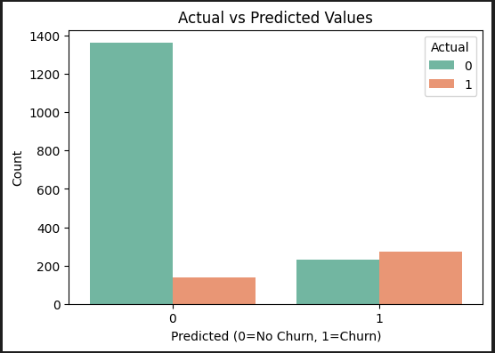
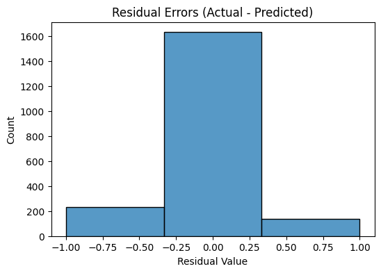

# mlproject | Bank-Customer Churn Prediction

_This project focuses on predicting customer churn using machine learning techniques on an imbalanced dataset. The goal was not just to maximize accuracy, but to improve detection of minority class (churned customers), which is critical for business decision-making_
   

---

# Table of Contents
<a href="#overview">Overview</a> 
<a href="#dataset">Dataset</a> 
<a href="#tools-technologies">Tools & Technologies</a> 
<a href="#data-cleaning-preparation">Data cleaning & Preparation</a> 
<a href="#exploratory-data-analysis-eda">Exploratory Data Analysis (EDA)</a> 
<a href="#Model-Selection">Model Selection</a> 
<a href="#Model-Training-and-Evaluation">Model Training and Evaluation</a> 
<a href="#Visualizations">Visualizations</a> 
<a href="#conclusion">Conclusion</a> 
<a href="#author-contact">Author Contact</a> 

---
<h2>Overview</h2>
The goal of this project is to predict the likelihood of a customer churning, enabling the bank to proactively identify at-risk customers and implement targeted retention strategies. This predictive capability will help the bank improve customer satisfaction, reduce churn rates, and optimize long-term profitability.

---
<h2>Dataset</h2>

-CSV file located in data folder consisting thousands of rows. 

---
<h2>Tool's and Technologies</h2>

-Python(Pandas, Matplotlib, Seaborn, Scipy) 
-scikit learn (ML) 
-GitHub

---
<h2>Data cleaning & Preparation</h2>
-Visualized distributions, class imbalance, and feature relationships.    
-Checked for the null values, duplicate values.

---
<h2>Exploratory Data Analysis (EDA)</h2>
-Get to know which factors influence performance.   
-Build a correlation-heatmap: 
  -Older customers tend to churn more Age 0.29.   
  -Inactive members are more likely to churn -0.16.   

features to be focussed:      
Age   
IsActiveMember    
Balance   

Other features like:    
CreditScore   
NumOfProducts   
Tenure    
Geography & Gender (after encoding)   

---
<h2>Model Selection</h2>
Model Selection & Training

->Data Preparation 
   -Prepared the data by separating the features (X) from the target variable (y), which is the Exited.   
   -Convert binary columns to 0/1 if not already like Gender.   
   -The categorical features are then processed using OneHotEncoder.      
   -The data is then split into training and testing sets, with 80% for training and 20% for testing.   

 **Models Evaluated:** 
  1. Random Forest (class-weighted) 
     -Applied class weights to give more importance to the minority class.    

      Result: High overall accuracy (86%) but low recall (0.43) for churned customers — many were missed.

  2. XGBoost (original) 
     -Default model without balancing techniques.   

     Result: Accuracy slightly lower (83%) but better recall (0.69) for minority class.

  3. Random Forest + SMOTE + Threshold Tuning (0.43) 
    -Oversampled minority class using SMOTE.    

     Tuned probability threshold to maximize F1-score for churned customers.    

     Result: Balanced performance — recall improved to 0.67 and F1-score 0.60, with overall accuracy of 82%.    

**Random Forest + SMOTE + threshold tuning** was chosen as the **best model.**

 **Model Evaluation:** 
-Measured accuracy using Accuracy, precision, Recall, F1 Score, Confusion Matrix

**Random Forest + SMOTE + threshold tuning** 
It significantly improved recall for the minority class.    
-Maintained good overall **accuracy** of **82%**.    
-Produced a better F1-score(0.60), reflecting balanced performance.   

---
<h2>Visualizations</h2>

 

-Actual vs. Predicted Plot → The model is stronger at predicting Class 0 (non-churners).    
    It still struggles with Class 1 (actual churners), which is common when there's class imbalance even after SMOTE. 

 
-Residuals Plot → Most values are 0, meaning the model predicts correctly most of the time.   
 
There are some residuals at -1 → these are False Positives (predicted churn when they didn’t).    
There are some residuals at +1 → these are False Negatives (actual churn but predicted not churn). 

---
<h2>Conclusion</h2>

-Model Accuracy: Random Forest + SMOTE + threshold tuning predicted with 82% accuracy.

-The evaluation process shows that for imbalanced datasets, accuracy alone is not sufficient.   
-Techniques like SMOTE, class weighting, and threshold tuning are crucial to select a model that captures the business-critical cases effectively.
 

**Value:** 
    -Helps identify customers likely to churn, enabling proactive retention strategies.   
    -Supports data-driven decision making for marketing, customer support, and sales teams.

Future Work: 
Feature Engineering:    
-Can Collect more features to improve model accuracy. 
-Try advanced models.

---
<h>Author Contact</h2>

**Simran Choudhary**
Data Analyst  
Email: choudharysimran235002@gmail.com  
[LinkedIn](https://www.linkedin.com/in/simran-choudhary-04a953299/)  
[Portfolio](https://portfoliosimran23.netlify.app/)